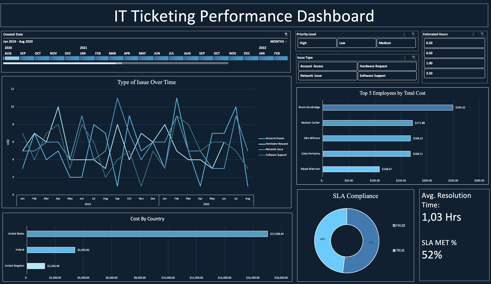

# IT Ticketing Dashboard (Excel)

This project is a professional IT Support Dashboard built using **Advanced Excel features**. It simulates a real-world ticketing system for tracking IT support issues, resolution times, SLA performance, and team performance.

## Features

- Total Tickets & Resolved Tickets KPIs
- Average Resolution Time
- SLA Compliance (Visualized via Pie Chart)
- Top 5 Employees by Total Ticket Cost (Pivot Table)
- Trendline of Ticket Volume Over Time
- Professional dashboard layout with dynamic visuals
- Designed for clean reporting and presentation

## Tools Used

- Microsoft Excel (Pivot Tables, Conditional Formatting, Slicers, Charts)
- Mock data simulating an IT ticketing system

## Use Case

Ideal for:
- Showcasing Excel dashboard and reporting skills
- Learning dashboard design best practices
- Demonstrating data analysis capabilities in a support setting

## 📷 Preview

## Outcome

This project showcases how Excel can be used for real-time business insights without the need for expensive BI tools. It’s portfolio-ready and demonstrates practical data skills in an IT context.

